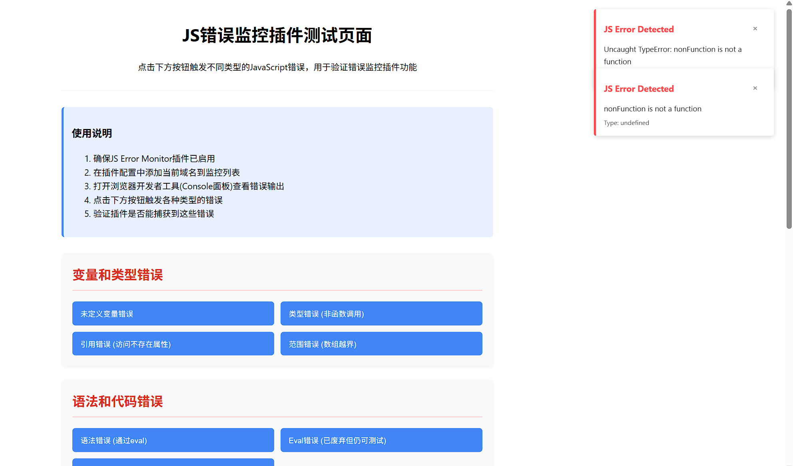
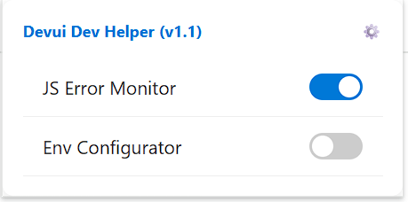
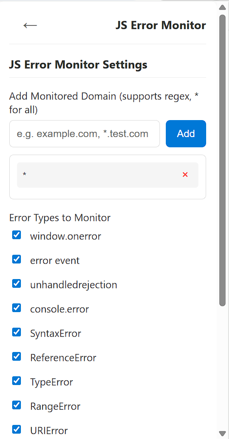

# DevUI Dev Helper - 开发者工具扩展


一个强大的前端开发提效工具，通过DevUI扩展增强您的开发工作流程。

## Features

### JS Error Monitor
> 实时监控网页JS错误并提示，避免在未打开控制台时漏掉重要错误。在错误上报的第一时间处理问题，而不是在埋点平台后续追踪。
- 实时JavaScript错误跟踪
- 可配置的错误类型过滤 (SyntaxError, ReferenceError, etc.)
- 自定义错误消息过滤
- 错误通知管理

<div style="text-align: center;">
  
  <p style="font-size: 0.8em; margin-top: 0.5em;">js-error-monitor 效果图</p>
</div>


### Env Configurator
> 劫持环境配置，修改配置参数，无时序影响
- 自定义环境设置参数
- 开发环境快速切换


### 更多功能欢迎贡献


## 安装方法

### 从Chrome应用商店安装
即将上线...

### 开发模式安装
1. Clone this repository 或下载 release压缩包
```bash
git clone https://gitcode.com/liuguolin/DevUIDevHelper.git
cd DevUIDevHelper
```

2. 在Chrome中加载扩展:
   - 打开Chrome浏览器并导航至 `chrome://extensions`
   - 在右上角启用"开发者模式"
   - 点击"加载已解压的扩展程序"并选择项目目录

## 使用说明

1. 点击浏览器工具栏中的DevUI Dev Helper图标打开主界面
2. 使用开关切换功能的开启/关闭状态
3. 点击"管理功能"自定义界面中显示的功能
4. 点击功能名称可配置各个功能的详细设置
5. 所有设置会自动保存

## 截图展示

### 主界面



### JS Error Monitor 功能配置页面



## 开发指南

### 前置要求
- Chrome浏览器

## 贡献指南

欢迎贡献代码！请随时提交Pull Request。

### Pull Request规范
1. Fork本仓库
2. 创建功能分支 (`git checkout -b feature/amazing-feature`)
3. 提交更改 (`git commit -m 'Add some amazing feature'`)
4. 推送到分支 (`git push origin feature/amazing-feature`)
5. 打开Pull Request

## 许可证

本项目采用MIT许可证 - 详见[LICENSE](LICENSE)文件。

## 致谢
- [DevUI设计系统](https://devui.design/)
- 所有为本项目做出贡献的开发者们

## Contact

- Project Link: [https://gitcode.com/liuguolin/DevUIDevHelper.git](https://gitcode.com/liuguolin/DevUIDevHelper.git)
- Issues: [https://gitcode.com/liuguolin/DevUIDevHelper.git/issues](https://gitcode.com/liuguolin/DevUIDevHelper.git/issues)